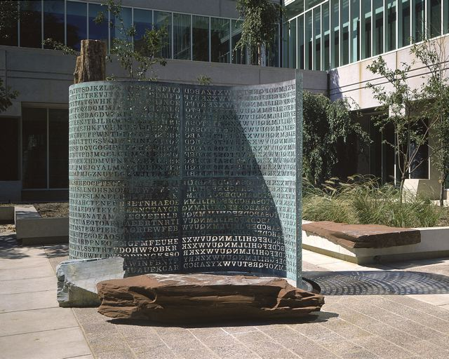

# FIN 4600 Lab: Pretty Good Privacy (PGP)

Michigan Technological University · College of Business · FIN 4600 Financial Technology Foundations



*Kryptos by Jim Sanborn, CIA Headquarters. Photo: Jim Sanborn, [CC BY-SA 3.0](https://creativecommons.org/licenses/by-sa/3.0/).*

In this two-session lab you create your own OpenPGP key, check and certify your instructor's key, and exchange a signed, encrypted message with your instructor. These are the same steps banks and payment processors follow when they set up encrypted file transfers with a new counterparty.

**The one rule to remember:** encrypt with the recipient's **public** key. Sign with your own **private** key.

## What's in this repository

| Path | Contents |
| --- | --- |
| `notebooks/FIN4600_PGP_Lab_Student.ipynb` | The lab notebook, Parts A to E |
| `docs/study-guide.md` | Concepts, diagrams, key terms, self-check questions, and the lab checklist |
| `docs/slides.md` | The lecture slides, with notes |
| `pyproject.toml` / `uv.lock` | Python packages for the notebook, managed by uv |
| `.gitignore` | Keeps keys, encrypted files, and your answers out of git |

## Initial Step - Clone this Repository - you do not have to fork it
I will not be grading your Jupyter Notebook. Since I am not going to be looking at your Jupyter Notebook coding changes up on GitHub - no reason to fork the repository you can just clone this one.

The Jupyter Notebook for this lab is just a tool to perform encryption/decryption and signing for you.

Clone this repository on your PC using Vs-code or git command line statements.

### Using Microsoft VS-Code
Within vs-code you can copy the url to this repository you are looking at right now: [https://github.com/jnorthey-mtu/mtu-fin4600-lab-pgp]
Then Ctrl-Shift-P to take you to the command prompt and type "git clone" run that command and paste the above URL.

### Using git from the powershell command line

From a Powershell or terminal you can enter a git clone command 

```git clone https://github.com/jnorthey-mtu/mtu-fin4600-lab-pgp.git my-folder```

## Before session 1

1. **Install GnuPG with a key manager.**
   - Windows: [Gpg4win](https://www.gpg4win.org) (includes Kleopatra)
   - macOS: [GPG Suite](https://gpgtools.org) (includes GPG Keychain)
2. **Install [uv](https://docs.astral.sh/uv/getting-started/installation/)**, then create the virtual environment and install the packages from this folder:

   ```bash
   uv sync
   ```

   The package is `python-gnupg`. Do **not** install the unrelated package named `gnupg`.
3. **Read** `docs/study-guide.md`.

Do not create your key pair yet. You will do that in class.

## Running the notebook

Run the notebook **on your own laptop**, not in Google Colab. It must use the same GnuPG keyring as Kleopatra or GPG Keychain.

```bash
uv run jupyter lab notebooks/FIN4600_PGP_Lab_Student.ipynb
```

VS Code with the Jupyter extension also works: open the notebook and pick the `.venv` created by `uv sync` in the kernel picker.

Save the files from Canvas (`instructor_pub.asc` in session 1, your `challenge_<user>.asc` in session 2) into the `notebooks/` folder, next to the notebook.

When GnuPG needs your passphrase, a separate window opens. If a cell seems stuck, look for that window behind your other windows.

## What you do

| Session | Notebook part | You will |
| --- | --- | --- |
| 1 | Part A | Watch Alice and Bob sign and encrypt in a throwaway sandbox |
| 1 | Part B | Find the primary key, subkey, and self-signatures in your own key |
| 1 | Part C | Compare the instructor's fingerprint with the one on the board, then certify the key |
| 1 | Part D | Upload `my_public_key.asc` to Canvas and type your fingerprint into the Canvas quiz |
| 2 | Part E | Decrypt your challenge, check the signature, and upload a signed, encrypted `response.asc` |

## Keep your private key private

- Never upload, email, or commit your private (secret) key. The notebook only exports your **public** key.
- The `.gitignore` blocks `.asc`, `.gpg`, `.pgp`, `.key`, and `.rev` files. Do not override it with `git add -f`.
- Back up your revocation certificate. GnuPG saves it in the `openpgp-revocs.d` folder of your GnuPG home.
- Don't publish your key to a keyserver. This class uses Canvas instead. Mac users: decline any upload offer from GPG Keychain.
- If you think your private key was exposed, tell your instructor right away. You will revoke it and create a new one.

## Troubleshooting

| Problem | Fix |
| --- | --- |
| `gpg not found` | Install Gpg4win or GPG Suite, then restart Jupyter |
| `uv: command not found` | Install uv, see [installation docs](https://docs.astral.sh/uv/getting-started/installation/) |
| `No module named gnupg`, or odd errors | `uv pip uninstall -y gnupg`, then `uv sync` |
| More than one key pair | Delete the extra key in Kleopatra, or set `MY_FPR_OVERRIDE` in the notebook |
| "unusable public key" or "no assurance" | Run the Part C cell again with the fingerprint from the board |
| "No secret key" when decrypting | Your challenge was made for a different key. Tell your instructor |
| Nothing happens | The passphrase window may be hidden behind other windows |

## Resources

- [Computerphile: Public Key Cryptography](https://www.youtube.com/watch?v=GSIDS_lvRv4)
- [Computerphile: What are Digital Signatures?](https://www.youtube.com/watch?v=s22eJ1eVLTU)
- [Computerphile: Key Exchange Problems](https://www.youtube.com/watch?v=vsXMMT2CqqE)
- [Kevin's Guides: PGP Encryption with Kleopatra](https://kevinsguides.com/guides/security/software/pgp-encryption/)
- [Gpg4win documentation](https://www.gpg4win.org/documentation.html)
- [python-gnupg documentation](https://gnupg.readthedocs.io/)
