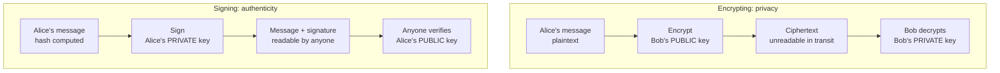
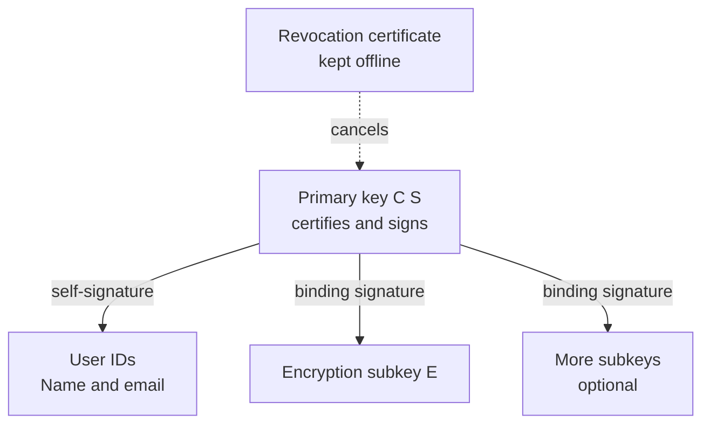
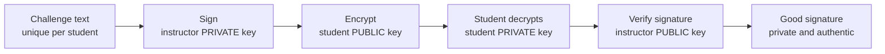

# FIN 4600 PGP Lab: Slides

The 14 lecture slides for session 1, with the instructor's notes. The diagrams below match the ones in the PowerPoint deck and in the [study guide](study-guide.md).

## Slide 1. Pretty Good Privacy: signing, encrypting, and trusting keys

*Kryptos by Jim Sanborn, CIA Headquarters. Photo: Jim Sanborn, [CC BY-SA 3.0](https://creativecommons.org/licenses/by-sa/3.0/).*

FIN 4600 Financial Technology Foundations · PGP Lab

Further reading: [Ed Scheidt, the CIA cryptographer behind Kryptos](https://en.wikipedia.org/wiki/Edward_Scheidt)

**Notes:**

Today every one of you makes a cryptographic identity, uses it to receive a private message from me, and proves that message really came from me. The same mechanics protect wire files between banks and sign the software updates on your laptop.

Open with the photo. This is Kryptos, dedicated in the CIA courtyard in 1990. Sculptor Jim Sanborn worked with Ed Scheidt, the retired chairman of the CIA Cryptographic Center, who designed its cipher systems. Its roughly 1,800 letters hold four encrypted passages. Three were solved in the 1990s; the fourth, K4, only 97 characters, resisted the CIA, the NSA, and thousands of amateurs for 35 years.

Bridge to today: Kryptos uses classical ciphers, where both sides need the same secret key. The problem PGP solves is how to communicate securely with someone you've never shared a secret with. Save the ending of the Kryptos story for the last slide.

## Slide 2. Why PGP still matters in finance

- Phil Zimmermann, 1991: free strong encryption for email
- Today: encrypted file transfers between banks, processors, and custodians (PGP over SFTP)
- Signed software releases and package managers
- Standard: OpenPGP, RFC 9580 (2024)

**Notes:**

PGP began as an email tool. In finance its biggest role now is batch file exchange: payroll files, ACH batches, and settlement reports travel as PGP-encrypted, signed files. When a counterparty onboards, the two sides swap public keys and confirm fingerprints, which is exactly this lab.

## Slide 3. Two problems, two tools

- Confidentiality: who can read it? → encryption
- Authenticity and integrity: who wrote it, and was it changed? → signing
- PGP can do either, or both

**Notes:**

Write both questions on the board and keep them there all class. Most confusion about PGP comes from mixing these two. A signed message is not secret. An encrypted but unsigned message could have come from anyone.

## Slide 4. Encrypting vs. signing

**Encrypt with the recipient's public key. Sign with your own private key.**

**Notes:**

Trace the left column: Alice encrypts to Bob's public key, and only Bob's private key opens it. Trace the right column: Alice signs with her private key, and anyone holding her public key can check it. The colors swap between columns: one public and one private key in each, in opposite order. Ask: "If I want to send you a secret, whose key do I need?" (Yours.) "If I want to prove I wrote it?" (Mine.)

## Slide 5. Hybrid encryption

- Random one-time session key encrypts the file (AES: fast)
- Recipient's public key encrypts only the session key (RSA or ECC: slow)
- Several recipients means the session key is wrapped once per recipient

**Notes:**

Public-key math is thousands of times slower than symmetric ciphers, so PGP uses it only to protect a small random key. This is also why your challenge file can be encrypted to both you and me: the same session key is wrapped twice.

## Slide 6. What a digital signature is

- Hash the message (SHA-256) → fixed-size fingerprint of the content
- Sign the hash with the private key
- Change one character → hash changes → verification fails

**Notes:**

In the demo you'll see a signed payment instruction for $5,000. We change it to $50,000 and verification flips to False. That is integrity. Remind students the signed text stayed perfectly readable.

## Slide 7. Anatomy of your key

**Notes:**

"New Key Pair" makes a bundle, not one key. The primary key certifies everything else and has the fingerprint. The user ID is your name and email. The encryption subkey is what people actually encrypt to. Every arrow is a signature by the primary key: a self-signature. The revocation certificate is your emergency off-switch. GnuPG saves one automatically; back it up.

## Slide 8. What a self-signature proves (and doesn't)

- Proves: whoever holds this private key attached this name
- Does NOT prove: the name is true
- Anyone can make a key that says "Jim Northey"

**Notes:**

This is the most important idea of the lab. Ask the class to make a key in my name. It works. Self-signatures stop tampering with the bundle, but they cannot stop impersonation. That's what the next slide solves.

## Slide 9. Fingerprints and certification

- Fingerprint = unique ID of the whole key bundle
- Check it through a second channel (board, phone, in person)
- Then certify ("lsign") the key → GnuPG treats it as valid
- Web of trust vs. certificate authorities

**Notes:**

The key file comes from Canvas; the fingerprint comes from the board. An attacker would have to fake both. Show the Computerphile "Key Exchange Problems" clip if time allows. Contrast: HTTPS trusts a few certificate authorities; PGP lets people vouch for each other.

## Slide 10. Where keys live: keyring vs. keyservers

- Your key lives only in your local keyring until you upload it
- keys.openpgp.org: publishes your email only after you verify it; removable
- Old SKS network: no deletion, abused in 2019, retired 2021
- Enterprise: WKD on the company domain, or commercial directories (Broadcom PGP Global Directory)
- This class: Canvas, not a keyserver

**Notes:**

Correct the common belief that making a key publishes it. It doesn't. Keyservers are optional directories, and they never prove ownership. We use Canvas to keep your name and email private and to practice fingerprint checking. Mac users: GPG Suite points at keys.openpgp.org by default, so decline any upload prompt.

## Slide 11. Kleopatra vocabulary

- Certificate = key
- Certify = sign someone's key
- Certified = valid
- Publish on Server = keyserver upload (skip it)

**Notes:**

Kleopatra uses X.509-style words because it also handles S/MIME. Keep this slide visible while students work in the GUI.

## Slide 12. Today's hands-on steps

1. Create ONE key pair (your @mtu.edu address, strong passphrase)
2. Notebook Part A: Alice and Bob sign and encrypt in a sandbox
3. Notebook Part B: find your primary key, subkey, and self-signatures
4. Notebook Part C: paste the board fingerprint, then certify the instructor key
5. Notebook Part D: public key → Canvas assignment; fingerprint → Canvas quiz

**Notes:**

Walk the room during key creation. The most common mistake is clicking New Key Pair twice. Anyone who does should delete the extra key now, or set MY_FPR_OVERRIDE in the notebook's configuration cell.

Everything runs in the student notebook, on each student's own laptop, not in Colab. Students save instructor_pub.asc from Canvas next to the notebook before Part C.

## Slide 13. The challenge

**Notes:**

I signed your file with my private key and encrypted it to your public key. You decrypt with your private key, and GnuPG checks my signature with my public key. Your reply reverses the roles. Ask: "Why can't your neighbor open your file?" (They don't have your private key.) "How do you know I sent it?" (My signature verified against the key whose fingerprint you checked.)

## Slide 14. Key care and review

- One key per person; strong passphrase; back up key and revocation certificate
- Keys expire: set 1–2 years, extend as needed
- Lost or stolen → publish the revocation certificate
- Exit ticket: "Sign with ___ key; encrypt with ___ key."

**Notes:**

Close with the exit ticket. Answers: sign with your own private key; encrypt with the recipient's public key. If most of the room gets it right, the lab worked.

Epilogue, back to Kryptos: in September 2025, two journalists, Jarett Kobek and Richard Byrne, found the K4 plaintext. They didn't break the cipher. They found it on scraps in Sanborn's own papers, which he had donated to the Smithsonian's Archives of American Art years earlier. The solution archive then sold at auction in November 2025 for $962,500. Lesson: real attacks usually go around the cryptography, not through it. Guard your private key, passphrase, and revocation certificate the way Sanborn should have guarded his notes.
