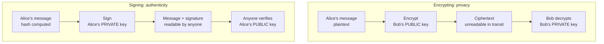
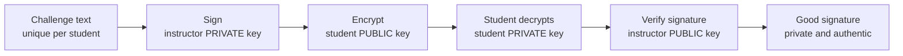
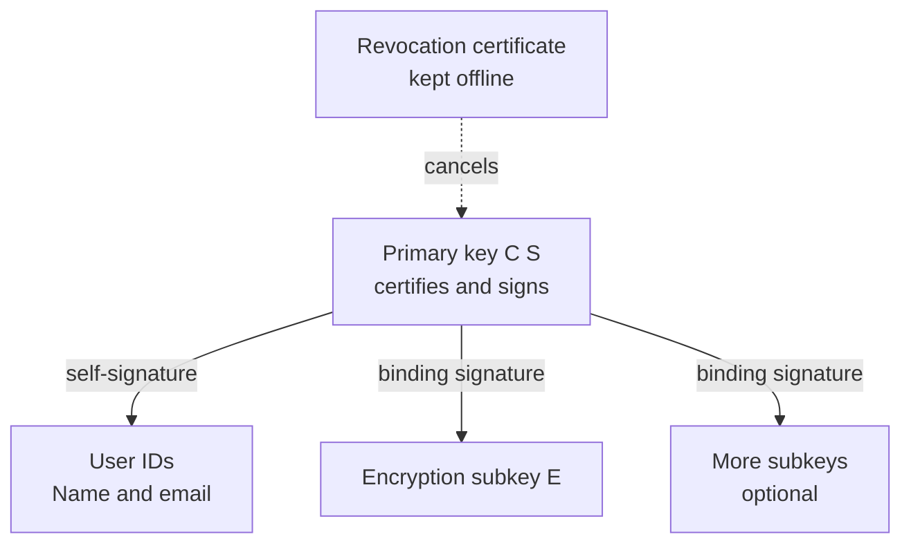
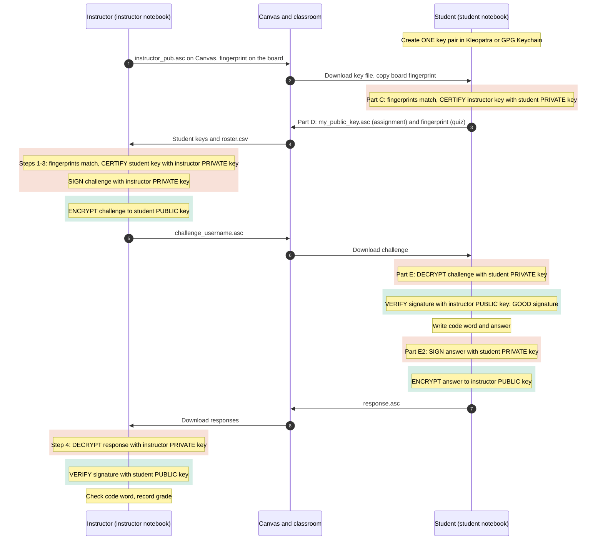

# FIN 4600 Study Guide: Pretty Good Privacy (PGP)

Use this guide before and after the two lab sessions. It covers what you need to create a key, check someone else's key, and send and receive signed, encrypted files.

## Learning objectives

After this lab you should be able to:

1. Explain the difference between encrypting and signing, and which key each one uses.
2. Describe the parts of an OpenPGP key: primary key, user ID, subkeys, self-signatures, and revocation certificate.
3. Explain what a self-signature proves and what it does not.
4. Verify a public key by comparing its fingerprint through a second channel, then certify it.
5. Explain what a keyserver is, and why creating a key does not publish it.
6. Connect PGP to real financial workflows such as encrypted file transfers between banks.

## The one rule to remember

> **Encrypt with the recipient's public key. Sign with your own private key.**

Encryption answers *who can read this?* Signing answers *who wrote this, and was it changed?* A signed message is not secret. An encrypted but unsigned message could have come from anyone.

## Encrypting vs. signing



| Step | Encrypting (privacy) | Signing (authenticity and integrity) |
| --- | --- | --- |
| 1 | Alice writes a message (plaintext) | Alice writes a message; a hash of it is computed |
| 2 | Encrypt with **Bob's public key** | Sign the hash with **Alice's private key** |
| 3 | Ciphertext: unreadable in transit | Message plus signature: still readable by anyone |
| 4 | Bob decrypts with **Bob's private key** | Anyone verifies with **Alice's public key** |

Each flow uses one public key and one private key, in opposite order.

### Hybrid encryption

PGP never encrypts a whole file with RSA or ECC, because public-key math is slow. It creates a random one-time **session key**, encrypts the file with a fast symmetric cipher (AES), and then encrypts only the session key with the recipient's public key. To encrypt to several people, PGP wraps the same session key once for each recipient.

### What a digital signature is

GnuPG hashes the message (for example with SHA-256) and signs the hash with the sender's private key. Changing even one character changes the hash, so verification fails. In the lab, changing $5,000 to $50,000 in a signed payment instruction makes the signature check fail.

### Your challenge file: sign, then encrypt



Your reply reverses the roles: you sign with your private key and encrypt to the instructor's public key.

## Anatomy of your key

Clicking **New Key Pair** creates a bundle, not a single key. One fingerprint identifies the whole bundle.



| Part | What it does |
| --- | --- |
| Primary key \[C S\] | Certifies the other parts and signs. Its fingerprint names the whole key. |
| User ID | Your name and email. A key can have more than one. |
| Self-signature | The primary key's signature on each user ID and subkey, tying the bundle together. |
| Encryption subkey \[E\] | The key people actually encrypt to. |
| Revocation certificate | Pre-signed notice that cancels the key if it is lost or stolen. GnuPG saves one in `openpgp-revocs.d`. Back it up. |

**What a self-signature proves:** whoever holds the private key attached this name. **What it does not prove:** that the name is true. Anyone can create a key claiming to be your instructor.

## Trust: fingerprints and certification

A key file proves nothing by itself. You make it trustworthy by comparing its **fingerprint** against one you received through a **different channel**, such as the board, a phone call, or in person. Then you **certify** it (*Certify* in Kleopatra, `lsign` in GnuPG). An attacker who swaps the key file on Canvas would also have to change the fingerprint on the board. Using two channels defeats a man-in-the-middle attack.

PGP uses a **web of trust**: any user can vouch for any key. HTTPS uses **certificate authorities**: a small set of organizations that browsers trust.

## Where keys live

Creating a key is purely local. It stays in your keyring until you choose to upload it. A **keyserver** is an optional public directory.

- **keys.openpgp.org** publishes your name and email only after you click a verification link, and lets you remove them.
- The older **SKS** network could not delete keys. It was abused in 2019 and shut down in 2021.
- Companies often publish keys on their own domain with **Web Key Directory (WKD)**, or use commercial directories.
- **In this class we use Canvas, not a keyserver.** It keeps your email private and lets us practice fingerprint checking. Mac users: decline any upload offer from GPG Keychain.

## PGP in finance

Banks, payment processors, and custodians exchange payroll files, ACH batches, and settlement reports as PGP-encrypted, signed files, usually over SFTP. When two firms start working together, they swap public keys and confirm fingerprints by phone or in a signed agreement. That is exactly the process you practice in this lab.

## Key terms checklist

Check each term once you can explain it in your own words.

- [ ] **Plaintext / ciphertext**: readable data / encrypted, unreadable data
- [ ] **Public key**: shared freely; used to encrypt to you and to verify your signatures
- [ ] **Private (secret) key**: never shared; used to decrypt and to sign
- [ ] **Encryption**: makes data readable only by the holder of the matching private key
- [ ] **Digital signature**: proof of who signed, and that the content has not changed
- [ ] **Hash**: fixed-size digest of data; any change gives a different hash
- [ ] **Session key**: random one-time symmetric key for the bulk encryption
- [ ] **Hybrid encryption**: fast symmetric cipher for the data, public-key encryption for the session key
- [ ] **OpenPGP**: the open standard behind PGP (RFC 9580)
- [ ] **GnuPG (gpg)**: the free OpenPGP software used by Kleopatra and GPG Suite
- [ ] **Key pair / certificate**: your public and private key (Kleopatra calls it a *certificate*)
- [ ] **Primary key**: the central key that certifies the other parts of your key
- [ ] **Subkey**: an extra key bound to the primary key, often used for encryption
- [ ] **User ID**: the name and email attached to a key
- [ ] **Self-signature**: the primary key's signature on its own user IDs and subkeys
- [ ] **Fingerprint**: the unique identifier of a key (40 hex characters)
- [ ] **Certify / lsign**: sign someone else's key after checking its fingerprint (lsign keeps it local)
- [ ] **Web of trust**: trust built from users vouching for each other's keys
- [ ] **Certificate authority**: a central organization that vouches for keys, as used in HTTPS
- [ ] **Man-in-the-middle**: an attacker who substitutes their own key during key exchange
- [ ] **Revocation certificate**: a pre-made notice that cancels a lost or stolen key
- [ ] **Keyserver**: an optional public directory of public keys
- [ ] **Web Key Directory (WKD)**: keys published on the email domain's own website
- [ ] **Keyring**: your local store of your keys and others' public keys
- [ ] **Pinentry**: the window that asks for your passphrase

## Self-check questions

1. You want to send your advisor a document only they can read. Whose key do you encrypt with: public or private?
2. You want to prove a document came from you. Which key do you use?
3. In the lab demo, why couldn't Alice decrypt the message she had just encrypted to Bob?
4. A signed message is intercepted. Can the interceptor read it? Can they change it without being detected?
5. Why does PGP use a session key instead of encrypting the whole file with RSA?
6. What does a self-signature prove? What does it not prove?
7. Why did we compare the instructor's fingerprint from the board instead of trusting the file on Canvas?
8. Does creating a key in Kleopatra publish it to the internet?
9. What should you do if your laptop with your private key is stolen?
10. Name one way banks use PGP today.

### Answers

1. The advisor's **public** key.
2. Your own **private** key.
3. It was encrypted to Bob's public key, so only Bob's private key opens it, and Alice doesn't have it.
4. Yes, they can read it, because signing is not encryption. No, they can't change it: the signature check would fail.
5. Public-key math is slow. A fast symmetric cipher encrypts the data, and the public key protects only the small session key.
6. It proves the key holder attached the name. It does not prove the name is true.
7. An attacker could replace the file. A second channel means they would have to fake both.
8. No. It stays in your local keyring unless you upload it.
9. Publish your revocation certificate, create a new key, and tell your contacts.
10. Encrypted, signed payroll, ACH, or settlement files over SFTP; verifying signed software releases.

## Getting started with the lab notebook

The whole lab runs in one Jupyter notebook, `notebooks/FIN4600_PGP_Lab_Student.ipynb`, in the course repository `mtu-fin4600-lab-pgp`.

1. Install **Gpg4win** (Windows) or **GPG Suite** (macOS).
2. Install **uv**, the Python project manager. It also installs the right Python version for you, so you don't need to install Python separately.
   - Windows (PowerShell): `powershell -ExecutionPolicy ByPass -c "irm https://astral.sh/uv/install.ps1 | iex"`
   - macOS: `brew install uv`, or `curl -LsSf https://astral.sh/uv/install.sh | sh`
   - Close and reopen your terminal afterward, then check with `uv --version`.
3. Clone the repository and set up its environment. `uv sync` reads `pyproject.toml` and installs everything the lab needs into a project folder called `.venv`:

   ```bash
   git clone <repository URL from Canvas>
   cd mtu-fin4600-lab-pgp
   uv sync
   uv run jupyter lab notebooks/FIN4600_PGP_Lab_Student.ipynb
   ```

   Always start Jupyter with `uv run` so the notebook uses the project's environment. In VS Code, open the repository folder and choose the `.venv` interpreter as the notebook kernel.
4. Run the notebook **on your own laptop**, not in Google Colab, so it uses the same keyring as Kleopatra or GPG Keychain.
5. Each time you open the notebook, run the **Setup** cells first. Put the fingerprint from the board, and later your challenge file name, in the **configuration cell**. Don't edit the code cells.

| Part | Session | What you do | Questions |
| --- | --- | --- | --- |
| A | 1 | Watch signing and encryption work between Alice and Bob | 1–3 |
| B | 1 | Look inside your own key | 4 |
| C | 1 | Check and certify your instructor's key | 5 |
| D | 1 | Export your public key for Canvas | — |
| E | 2 | Decrypt your challenge and send a signed, encrypted answer | 6 |

## Lab flow at a glance

The whole lab is one round trip: your instructor's key and challenge travel to you, and your signed answer travels back. Watch which key each step uses. **Private-key steps** (shaded red/coral) can only be done by the key's owner: signing, decrypting, and certifying. **Public-key steps** (shaded green/teal) can be done by anyone: encrypting and verifying.

### Mermaid sequence diagram



The pattern repeats in both directions: **sign with your own private key, then encrypt to the other person's public key.** The receiver undoes it in reverse: **decrypt with their own private key, then verify with the sender's public key.**

### BPMN diagram for bpmn.io

The same flow as a BPMN collaboration: one pool for the instructor, one for the student, with message flows for each file that crosses between them. Private-key tasks are coral and public-key tasks are teal. To view or edit it:

1. Copy the XML below into a plain-text editor and save it as `pgp-lab-flow.bpmn`.
2. Go to [demo.bpmn.io](https://demo.bpmn.io), choose **Open**, and pick the file (or drag it onto the page).
3. From bpmn.io you can download it as an SVG or PNG image for slides.

```xml
<?xml version="1.0" encoding="UTF-8"?>
<bpmn:definitions xmlns:bpmn="http://www.omg.org/spec/BPMN/20100524/MODEL" xmlns:bpmndi="http://www.omg.org/spec/BPMN/20100524/DI" xmlns:dc="http://www.omg.org/spec/DD/20100524/DC" xmlns:di="http://www.omg.org/spec/DD/20100524/DI" xmlns:bioc="http://bpmn.io/schema/bpmn/biocolor/1.0" xmlns:color="http://www.omg.org/spec/BPMN/non-normative/color/1.0" id="Defs_PGPLab" targetNamespace="http://bpmn.io/schema/bpmn">
  <bpmn:collaboration id="Collab_PGPLab">
    <bpmn:participant id="P_Instructor" name="Instructor (instructor notebook)" processRef="Proc_Instructor" />
    <bpmn:participant id="P_Student" name="Student (student notebook)" processRef="Proc_Student" />
    <bpmn:messageFlow id="MF1" name="instructor_pub.asc + fingerprint on board" sourceRef="I_Publish" targetRef="S_Certify" />
    <bpmn:messageFlow id="MF2" name="my_public_key.asc + fingerprint" sourceRef="S_Export" targetRef="I_Certify" />
    <bpmn:messageFlow id="MF3" name="challenge_username.asc" sourceRef="I_Encrypt" targetRef="S_Decrypt" />
    <bpmn:messageFlow id="MF4" name="response.asc" sourceRef="S_Encrypt" targetRef="I_Decrypt" />
    <bpmn:textAnnotation id="Legend">
      <bpmn:text>Coral = uses a PRIVATE key (certify, sign, decrypt). Teal = uses a PUBLIC key (encrypt, verify).</bpmn:text>
    </bpmn:textAnnotation>
  </bpmn:collaboration>
  <bpmn:process id="Proc_Instructor" isExecutable="false">
    <bpmn:startEvent id="I_Start" name="Lab begins">
      <bpmn:outgoing>IF1</bpmn:outgoing>
    </bpmn:startEvent>
    <bpmn:task id="I_Publish" name="Publish public key + fingerprint">
      <bpmn:incoming>IF1</bpmn:incoming>
      <bpmn:outgoing>IF2</bpmn:outgoing>
    </bpmn:task>
    <bpmn:task id="I_Certify" name="Steps 1-3: verify + CERTIFY student keys (instructor private key)">
      <bpmn:incoming>IF2</bpmn:incoming>
      <bpmn:outgoing>IF3</bpmn:outgoing>
    </bpmn:task>
    <bpmn:task id="I_Sign" name="SIGN challenge (instructor private key)">
      <bpmn:incoming>IF3</bpmn:incoming>
      <bpmn:outgoing>IF4</bpmn:outgoing>
    </bpmn:task>
    <bpmn:task id="I_Encrypt" name="ENCRYPT challenge (student public key)">
      <bpmn:incoming>IF4</bpmn:incoming>
      <bpmn:outgoing>IF5</bpmn:outgoing>
    </bpmn:task>
    <bpmn:task id="I_Decrypt" name="Step 4: DECRYPT response (instructor private key)">
      <bpmn:incoming>IF5</bpmn:incoming>
      <bpmn:outgoing>IF6</bpmn:outgoing>
    </bpmn:task>
    <bpmn:task id="I_Verify" name="VERIFY signature (student public key)">
      <bpmn:incoming>IF6</bpmn:incoming>
      <bpmn:outgoing>IF7</bpmn:outgoing>
    </bpmn:task>
    <bpmn:task id="I_Grade" name="Check code word, record grade">
      <bpmn:incoming>IF7</bpmn:incoming>
      <bpmn:outgoing>IF8</bpmn:outgoing>
    </bpmn:task>
    <bpmn:endEvent id="I_End" name="Graded">
      <bpmn:incoming>IF8</bpmn:incoming>
    </bpmn:endEvent>
    <bpmn:sequenceFlow id="IF1" sourceRef="I_Start" targetRef="I_Publish" />
    <bpmn:sequenceFlow id="IF2" sourceRef="I_Publish" targetRef="I_Certify" />
    <bpmn:sequenceFlow id="IF3" sourceRef="I_Certify" targetRef="I_Sign" />
    <bpmn:sequenceFlow id="IF4" sourceRef="I_Sign" targetRef="I_Encrypt" />
    <bpmn:sequenceFlow id="IF5" sourceRef="I_Encrypt" targetRef="I_Decrypt" />
    <bpmn:sequenceFlow id="IF6" sourceRef="I_Decrypt" targetRef="I_Verify" />
    <bpmn:sequenceFlow id="IF7" sourceRef="I_Verify" targetRef="I_Grade" />
    <bpmn:sequenceFlow id="IF8" sourceRef="I_Grade" targetRef="I_End" />
  </bpmn:process>
  <bpmn:process id="Proc_Student" isExecutable="false">
    <bpmn:startEvent id="S_Start" name="Lab begins">
      <bpmn:outgoing>SF1</bpmn:outgoing>
    </bpmn:startEvent>
    <bpmn:task id="S_Create" name="Create ONE key pair">
      <bpmn:incoming>SF1</bpmn:incoming>
      <bpmn:outgoing>SF2</bpmn:outgoing>
    </bpmn:task>
    <bpmn:task id="S_Certify" name="Part C: verify + CERTIFY instructor key (student private key)">
      <bpmn:incoming>SF2</bpmn:incoming>
      <bpmn:outgoing>SF3</bpmn:outgoing>
    </bpmn:task>
    <bpmn:task id="S_Export" name="Part D: export public key">
      <bpmn:incoming>SF3</bpmn:incoming>
      <bpmn:outgoing>SF4</bpmn:outgoing>
    </bpmn:task>
    <bpmn:task id="S_Decrypt" name="Part E: DECRYPT challenge (student private key)">
      <bpmn:incoming>SF4</bpmn:incoming>
      <bpmn:outgoing>SF5</bpmn:outgoing>
    </bpmn:task>
    <bpmn:task id="S_Verify" name="VERIFY signature (instructor public key)">
      <bpmn:incoming>SF5</bpmn:incoming>
      <bpmn:outgoing>SF6</bpmn:outgoing>
    </bpmn:task>
    <bpmn:task id="S_Answer" name="Write code word + answer">
      <bpmn:incoming>SF6</bpmn:incoming>
      <bpmn:outgoing>SF7</bpmn:outgoing>
    </bpmn:task>
    <bpmn:task id="S_Sign" name="Part E2: SIGN answer (student private key)">
      <bpmn:incoming>SF7</bpmn:incoming>
      <bpmn:outgoing>SF8</bpmn:outgoing>
    </bpmn:task>
    <bpmn:task id="S_Encrypt" name="ENCRYPT answer (instructor public key)">
      <bpmn:incoming>SF8</bpmn:incoming>
      <bpmn:outgoing>SF9</bpmn:outgoing>
    </bpmn:task>
    <bpmn:endEvent id="S_End" name="Response submitted">
      <bpmn:incoming>SF9</bpmn:incoming>
    </bpmn:endEvent>
    <bpmn:sequenceFlow id="SF1" sourceRef="S_Start" targetRef="S_Create" />
    <bpmn:sequenceFlow id="SF2" sourceRef="S_Create" targetRef="S_Certify" />
    <bpmn:sequenceFlow id="SF3" sourceRef="S_Certify" targetRef="S_Export" />
    <bpmn:sequenceFlow id="SF4" sourceRef="S_Export" targetRef="S_Decrypt" />
    <bpmn:sequenceFlow id="SF5" sourceRef="S_Decrypt" targetRef="S_Verify" />
    <bpmn:sequenceFlow id="SF6" sourceRef="S_Verify" targetRef="S_Answer" />
    <bpmn:sequenceFlow id="SF7" sourceRef="S_Answer" targetRef="S_Sign" />
    <bpmn:sequenceFlow id="SF8" sourceRef="S_Sign" targetRef="S_Encrypt" />
    <bpmn:sequenceFlow id="SF9" sourceRef="S_Encrypt" targetRef="S_End" />
  </bpmn:process>
  <bpmndi:BPMNDiagram id="Diagram_PGPLab">
    <bpmndi:BPMNPlane id="Plane_PGPLab" bpmnElement="Collab_PGPLab">
      <bpmndi:BPMNShape id="P_Instructor_di" bpmnElement="P_Instructor" isHorizontal="true">
        <dc:Bounds x="160" y="80" width="2380" height="180" />
      </bpmndi:BPMNShape>
      <bpmndi:BPMNShape id="P_Student_di" bpmnElement="P_Student" isHorizontal="true">
        <dc:Bounds x="160" y="340" width="2380" height="180" />
      </bpmndi:BPMNShape>
      <bpmndi:BPMNShape id="Legend_di" bpmnElement="Legend">
        <dc:Bounds x="160" y="10" width="620" height="40" />
      </bpmndi:BPMNShape>
      <bpmndi:BPMNShape id="I_Start_di" bpmnElement="I_Start">
        <dc:Bounds x="210" y="152" width="36" height="36" />
        <bpmndi:BPMNLabel><dc:Bounds x="200" y="195" width="56" height="14" /></bpmndi:BPMNLabel>
      </bpmndi:BPMNShape>
      <bpmndi:BPMNShape id="I_Publish_di" bpmnElement="I_Publish">
        <dc:Bounds x="280" y="125" width="120" height="90" />
      </bpmndi:BPMNShape>
      <bpmndi:BPMNShape id="I_Certify_di" bpmnElement="I_Certify" bioc:stroke="#993C1D" bioc:fill="#FAECE7" color:background-color="#FAECE7" color:border-color="#993C1D">
        <dc:Bounds x="760" y="125" width="120" height="90" />
      </bpmndi:BPMNShape>
      <bpmndi:BPMNShape id="I_Sign_di" bpmnElement="I_Sign" bioc:stroke="#993C1D" bioc:fill="#FAECE7" color:background-color="#FAECE7" color:border-color="#993C1D">
        <dc:Bounds x="910" y="125" width="120" height="90" />
      </bpmndi:BPMNShape>
      <bpmndi:BPMNShape id="I_Encrypt_di" bpmnElement="I_Encrypt" bioc:stroke="#0F6E56" bioc:fill="#E1F5EE" color:background-color="#E1F5EE" color:border-color="#0F6E56">
        <dc:Bounds x="1060" y="125" width="120" height="90" />
      </bpmndi:BPMNShape>
      <bpmndi:BPMNShape id="I_Decrypt_di" bpmnElement="I_Decrypt" bioc:stroke="#993C1D" bioc:fill="#FAECE7" color:background-color="#FAECE7" color:border-color="#993C1D">
        <dc:Bounds x="2020" y="125" width="120" height="90" />
      </bpmndi:BPMNShape>
      <bpmndi:BPMNShape id="I_Verify_di" bpmnElement="I_Verify" bioc:stroke="#0F6E56" bioc:fill="#E1F5EE" color:background-color="#E1F5EE" color:border-color="#0F6E56">
        <dc:Bounds x="2170" y="125" width="120" height="90" />
      </bpmndi:BPMNShape>
      <bpmndi:BPMNShape id="I_Grade_di" bpmnElement="I_Grade">
        <dc:Bounds x="2320" y="125" width="120" height="90" />
      </bpmndi:BPMNShape>
      <bpmndi:BPMNShape id="I_End_di" bpmnElement="I_End">
        <dc:Bounds x="2480" y="152" width="36" height="36" />
        <bpmndi:BPMNLabel><dc:Bounds x="2478" y="195" width="40" height="14" /></bpmndi:BPMNLabel>
      </bpmndi:BPMNShape>
      <bpmndi:BPMNShape id="S_Start_di" bpmnElement="S_Start">
        <dc:Bounds x="210" y="412" width="36" height="36" />
        <bpmndi:BPMNLabel><dc:Bounds x="200" y="455" width="56" height="14" /></bpmndi:BPMNLabel>
      </bpmndi:BPMNShape>
      <bpmndi:BPMNShape id="S_Create_di" bpmnElement="S_Create">
        <dc:Bounds x="280" y="385" width="120" height="90" />
      </bpmndi:BPMNShape>
      <bpmndi:BPMNShape id="S_Certify_di" bpmnElement="S_Certify" bioc:stroke="#993C1D" bioc:fill="#FAECE7" color:background-color="#FAECE7" color:border-color="#993C1D">
        <dc:Bounds x="430" y="385" width="120" height="90" />
      </bpmndi:BPMNShape>
      <bpmndi:BPMNShape id="S_Export_di" bpmnElement="S_Export">
        <dc:Bounds x="580" y="385" width="120" height="90" />
      </bpmndi:BPMNShape>
      <bpmndi:BPMNShape id="S_Decrypt_di" bpmnElement="S_Decrypt" bioc:stroke="#993C1D" bioc:fill="#FAECE7" color:background-color="#FAECE7" color:border-color="#993C1D">
        <dc:Bounds x="1240" y="385" width="120" height="90" />
      </bpmndi:BPMNShape>
      <bpmndi:BPMNShape id="S_Verify_di" bpmnElement="S_Verify" bioc:stroke="#0F6E56" bioc:fill="#E1F5EE" color:background-color="#E1F5EE" color:border-color="#0F6E56">
        <dc:Bounds x="1390" y="385" width="120" height="90" />
      </bpmndi:BPMNShape>
      <bpmndi:BPMNShape id="S_Answer_di" bpmnElement="S_Answer">
        <dc:Bounds x="1540" y="385" width="120" height="90" />
      </bpmndi:BPMNShape>
      <bpmndi:BPMNShape id="S_Sign_di" bpmnElement="S_Sign" bioc:stroke="#993C1D" bioc:fill="#FAECE7" color:background-color="#FAECE7" color:border-color="#993C1D">
        <dc:Bounds x="1690" y="385" width="120" height="90" />
      </bpmndi:BPMNShape>
      <bpmndi:BPMNShape id="S_Encrypt_di" bpmnElement="S_Encrypt" bioc:stroke="#0F6E56" bioc:fill="#E1F5EE" color:background-color="#E1F5EE" color:border-color="#0F6E56">
        <dc:Bounds x="1840" y="385" width="120" height="90" />
      </bpmndi:BPMNShape>
      <bpmndi:BPMNShape id="S_End_di" bpmnElement="S_End">
        <dc:Bounds x="2000" y="412" width="36" height="36" />
        <bpmndi:BPMNLabel><dc:Bounds x="1975" y="455" width="86" height="14" /></bpmndi:BPMNLabel>
      </bpmndi:BPMNShape>
      <bpmndi:BPMNEdge id="IF1_di" bpmnElement="IF1"><di:waypoint x="246" y="170" /><di:waypoint x="280" y="170" /></bpmndi:BPMNEdge>
      <bpmndi:BPMNEdge id="IF2_di" bpmnElement="IF2"><di:waypoint x="400" y="170" /><di:waypoint x="760" y="170" /></bpmndi:BPMNEdge>
      <bpmndi:BPMNEdge id="IF3_di" bpmnElement="IF3"><di:waypoint x="880" y="170" /><di:waypoint x="910" y="170" /></bpmndi:BPMNEdge>
      <bpmndi:BPMNEdge id="IF4_di" bpmnElement="IF4"><di:waypoint x="1030" y="170" /><di:waypoint x="1060" y="170" /></bpmndi:BPMNEdge>
      <bpmndi:BPMNEdge id="IF5_di" bpmnElement="IF5"><di:waypoint x="1180" y="170" /><di:waypoint x="2020" y="170" /></bpmndi:BPMNEdge>
      <bpmndi:BPMNEdge id="IF6_di" bpmnElement="IF6"><di:waypoint x="2140" y="170" /><di:waypoint x="2170" y="170" /></bpmndi:BPMNEdge>
      <bpmndi:BPMNEdge id="IF7_di" bpmnElement="IF7"><di:waypoint x="2290" y="170" /><di:waypoint x="2320" y="170" /></bpmndi:BPMNEdge>
      <bpmndi:BPMNEdge id="IF8_di" bpmnElement="IF8"><di:waypoint x="2440" y="170" /><di:waypoint x="2480" y="170" /></bpmndi:BPMNEdge>
      <bpmndi:BPMNEdge id="SF1_di" bpmnElement="SF1"><di:waypoint x="246" y="430" /><di:waypoint x="280" y="430" /></bpmndi:BPMNEdge>
      <bpmndi:BPMNEdge id="SF2_di" bpmnElement="SF2"><di:waypoint x="400" y="430" /><di:waypoint x="430" y="430" /></bpmndi:BPMNEdge>
      <bpmndi:BPMNEdge id="SF3_di" bpmnElement="SF3"><di:waypoint x="550" y="430" /><di:waypoint x="580" y="430" /></bpmndi:BPMNEdge>
      <bpmndi:BPMNEdge id="SF4_di" bpmnElement="SF4"><di:waypoint x="700" y="430" /><di:waypoint x="1240" y="430" /></bpmndi:BPMNEdge>
      <bpmndi:BPMNEdge id="SF5_di" bpmnElement="SF5"><di:waypoint x="1360" y="430" /><di:waypoint x="1390" y="430" /></bpmndi:BPMNEdge>
      <bpmndi:BPMNEdge id="SF6_di" bpmnElement="SF6"><di:waypoint x="1510" y="430" /><di:waypoint x="1540" y="430" /></bpmndi:BPMNEdge>
      <bpmndi:BPMNEdge id="SF7_di" bpmnElement="SF7"><di:waypoint x="1660" y="430" /><di:waypoint x="1690" y="430" /></bpmndi:BPMNEdge>
      <bpmndi:BPMNEdge id="SF8_di" bpmnElement="SF8"><di:waypoint x="1810" y="430" /><di:waypoint x="1840" y="430" /></bpmndi:BPMNEdge>
      <bpmndi:BPMNEdge id="SF9_di" bpmnElement="SF9"><di:waypoint x="1960" y="430" /><di:waypoint x="2000" y="430" /></bpmndi:BPMNEdge>
      <bpmndi:BPMNEdge id="MF1_di" bpmnElement="MF1"><di:waypoint x="340" y="215" /><di:waypoint x="340" y="300" /><di:waypoint x="490" y="300" /><di:waypoint x="490" y="385" />
        <bpmndi:BPMNLabel><dc:Bounds x="345" y="268" width="140" height="27" /></bpmndi:BPMNLabel></bpmndi:BPMNEdge>
      <bpmndi:BPMNEdge id="MF2_di" bpmnElement="MF2"><di:waypoint x="640" y="385" /><di:waypoint x="640" y="300" /><di:waypoint x="820" y="300" /><di:waypoint x="820" y="215" />
        <bpmndi:BPMNLabel><dc:Bounds x="650" y="305" width="160" height="27" /></bpmndi:BPMNLabel></bpmndi:BPMNEdge>
      <bpmndi:BPMNEdge id="MF3_di" bpmnElement="MF3"><di:waypoint x="1120" y="215" /><di:waypoint x="1120" y="300" /><di:waypoint x="1300" y="300" /><di:waypoint x="1300" y="385" />
        <bpmndi:BPMNLabel><dc:Bounds x="1140" y="280" width="140" height="14" /></bpmndi:BPMNLabel></bpmndi:BPMNEdge>
      <bpmndi:BPMNEdge id="MF4_di" bpmnElement="MF4"><di:waypoint x="1900" y="385" /><di:waypoint x="1900" y="300" /><di:waypoint x="2080" y="300" /><di:waypoint x="2080" y="215" />
        <bpmndi:BPMNLabel><dc:Bounds x="1950" y="305" width="80" height="14" /></bpmndi:BPMNLabel></bpmndi:BPMNEdge>
    </bpmndi:BPMNPlane>
  </bpmndi:BPMNDiagram>
</bpmn:definitions>
```

## Lab checklist

### Session 1

- [ ] Installed Gpg4win (Windows) or GPG Suite (macOS) and uv, cloned the repository, and ran `uv sync`
- [ ] Created **exactly one** key pair with your @mtu.edu address and a strong passphrase
- [ ] Started Jupyter with `uv run jupyter lab`, ran the Setup cells and Part A (Alice and Bob); answered Questions 1–3
- [ ] Ran Part B and found your primary key, subkey, and self-signatures; answered Question 4
- [ ] Pasted the board fingerprint into the configuration cell and ran Part C: fingerprint matched, instructor key certified; answered Question 5
- [ ] Ran Part D: uploaded `my_public_key.asc` to the Canvas assignment and typed your fingerprint into the Canvas quiz
- [ ] Backed up your revocation certificate

### Session 2

- [ ] Re-ran the Setup cells and Part B, and set `CHALLENGE_FILE` in the configuration cell
- [ ] Ran Part E: decrypted your challenge and saw **GOOD signature** from the instructor; answered Question 6
- [ ] Put your code word and answer in the `ANSWER` cell and ran Part E2 to create `response.asc`
- [ ] Uploaded `response.asc` to Canvas

## Common mistakes

| Mistake | What to do |
| --- | --- |
| Created two key pairs | Delete the extra one in Kleopatra, or set `MY_FPR_OVERRIDE` in the notebook |
| `uv: command not found` | Close and reopen the terminal after installing uv; on Windows, open a new PowerShell window |
| Notebook says `No module named gnupg` | Jupyter isn't using the project environment. Run `uv sync`, then start Jupyter with `uv run jupyter lab`; in VS Code, select the `.venv` kernel |
| Installed packages with `pip` | Not needed and can cause conflicts. Run `uv sync` to restore the environment from `pyproject.toml` |
| Nothing happens when a cell runs | The passphrase window may be hidden behind other windows |
| Uploaded or committed your private key | Tell your instructor right away, revoke the key, and create a new one |
| Ran the notebook in Google Colab | Run it on your own laptop so it uses your Kleopatra or GPG Keychain keyring |

## Videos and resources

- [Computerphile: Public Key Cryptography](https://www.youtube.com/watch?v=GSIDS_lvRv4) (about 6 minutes)
- [Computerphile: What are Digital Signatures?](https://www.youtube.com/watch?v=s22eJ1eVLTU) (about 10 minutes)
- [Computerphile: Key Exchange Problems](https://www.youtube.com/watch?v=vsXMMT2CqqE) (about 10 minutes)
- [Kevin's Guides: PGP Encryption with Kleopatra](https://kevinsguides.com/guides/security/software/pgp-encryption/)
- [Gpg4win documentation](https://www.gpg4win.org/documentation.html) and [GPG Suite](https://gpgtools.org)
- [keys.openpgp.org: how the keyserver works](https://keys.openpgp.org/about/)
